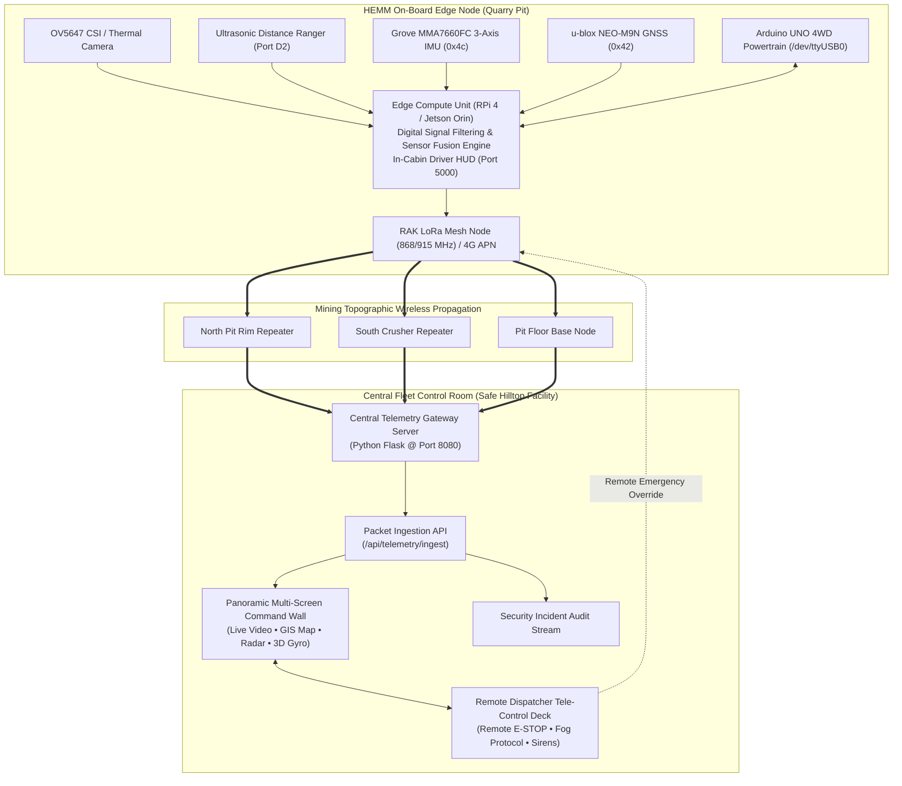

# Mine Vision-X
### AI-Based Fog-Safe HEMM Vehicle Safety & Central Fleet Monitoring System
> **"Innovation at Depth. Insight in Motion." — Team Vision Travelers**

[](LICENSE)
[](https://www.python.org/)
[](https://developer.nvidia.com/embedded/jetson-orin)
[](https://www.arduino.cc/)
[]()
[](https://palletsprojects.com/p/flask/)
[]()

---

## 📺 Project Video Demonstration

Watch the complete demonstration video on YouTube:  
▶️ **[Mine Vision-X — Video Demonstration](https://youtu.be/JxRxO8PUYvE)**

| 77 GHz mmWave Radar (`00:20`) | u-blox NEO-M9N GNSS (`00:25`) | Thermal IR Fog Vision (`00:35`) |
| :---: | :---: | :---: |
|  |  |  |
| **LoRa Mesh Propagation (`01:10`)** | **Driver ADAS HUD (`01:25`)** | **Central Control Room (`01:38`)** |
|  |  |  |

---

## 📌 Executive Summary

**Mine Vision-X** is an edge-intelligent vehicle safety, driver-assistance (ADAS), and central fleet monitoring platform engineered specifically for **Heavy Earth Moving Machinery (HEMM)**—including 100-ton haul dumpers, hydraulic excavators, wheel loaders, and track bulldozers—operating in high-risk open-pit and subterranean mining environments.

Surface mining operations subject heavy machinery to extreme visibility impairment: dense winter fog, high-particulate coal/silica dust clouds, blinding rain, and severe terrain slopes. **Mine Vision-X** operates as a synchronized two-tier platform:
1. **On-Vehicle Edge Perception Node**: On-board AI compute (Raspberry Pi 4 / NVIDIA Jetson Orin Nano) fusing 77 GHz mmWave radar, LWIR thermal vision, sub-meter ultrasonic ranging, 6-axis IMU rollover dynamics, and GNSS positioning into an ultra-low latency in-cabin driver HUD.
2. **Central Office Security Surveillance & Fleet Control Room**: Situated safely in a hilltop command facility away from the quarry hazards, continuously ingesting telemetry transmuted over an industrial **Hybrid 4G / LoRa Mesh Network**, plotting multi-vehicle GIS tracks, and providing remote emergency override (E-STOP, sirens, speed governors).

---

## 🗂️ Clean Repository Organization

To ensure maximum clarity for developers, reviewers, and industrial evaluators, the repository is organized into distinct, self-contained subsystems:

```
Mine-Vision-X/
│
├── 📂 vehicle_edge/                  # [Subsystem 1] In-Cabin Vehicle ADAS & Edge Telematics Node
│   ├── app.py                       # Vehicle edge Flask server & sensor fusion daemon (Port 5000)
│   ├── index.html                   # High-fidelity driver HUD kiosk dashboard
│   ├── vehicle_transmuter_client.py # LoRa Mesh / 4G telemetry transmuter client
│   ├── launch_vehicle_hud.bat       # 1-Click launcher for vehicle dashboard
│   ├── grovepi-telemetry.service    # Linux systemd auto-start daemon unit
│   ├── README.md                    # Detailed documentation for vehicle edge node
│   └── static/                      # Static 3D models, textures, and Three.js engine
│
├── 📂 fleet_control_room/           # [Subsystem 2] Central Office Security Surveillance Command Center
│   ├── server.py                    # Central Command Gateway & LoRa ingestion server (Port 8080)
│   ├── launch_fleet_control.bat     # 1-Click launcher for Control Room Command Wall
│   ├── README.md                    # Central control room documentation
│   ├── templates/
│   │   └── index.html               # Multi-screen Command Wall UI (matching video frame 098s)
│   └── static/
│       ├── css/control_room.css     # Cyberpunk industrial command center styling
│       └── js/
│           ├── app.js               # Fleet synchronization & remote tele-actions (10 Hz)
│           ├── map_engine.js        # Open-pit mine topographical GIS & collision avoidance
│           ├── radar_visualizer.js  # 77 GHz mmWave polar radar sweep visualizer
│           ├── attitude_gyro.js     # Three.js 3D Haul Truck attitude & rollover gyro
│           ├── sound_effects.js     # Web Audio API industrial sirens & beeps
│           └── three.min.js         # Offline Three.js 3D library
│
├── 📂 hardware_diagnostics/         # [Subsystem 3] Sensor Probing, Calibration & Hardware Test Suite
│   ├── probe_sensors.py             # I2C bus arbiter & sensor address scan (NEO-M9N & MMA7660)
│   ├── read_gps.py                  # u-blox NEO-M9N raw NMEA sentence stream decoder
│   ├── test_imu_stability.py        # MMA7660 accelerometer noise & EMA filter validator
│   ├── probe_ultrasonic.py          # GrovePi digital port distance probe (D2-D8)
│   ├── check_arduino.py             # Arduino UNO serial handshake & encoder test
│   ├── monitor_arduino.py           # Real-time serial RPM & telemetry stream monitor
│   ├── send_motor_cmd.py            # Manual directional motor command test (F/B/L/R/S)
│   ├── test_commands.py             # Automated motor response & failsafe stress test
│   └── README.md                    # Guide explaining all diagnostic utilities
│
├── 📂 docs/                         # [Documentation & Media]
│   ├── SYSTEM_ARCHITECTURE.md       # In-depth technical architecture & LoRa transmutation specs
│   ├── WIRING_AND_PINOUTS.md        # Hardware connection pinouts (I2C, Serial, GrovePi, CSI)
│   ├── images/                      # Dashboard UI preview screenshots
│   └── reference_video_assets/      # 25 High-resolution keyframes from YouTube video
│
├── 📄 app.py                        # Unified launcher dispatcher (Vehicle / Control / Diag)
├── 📄 launch_vehicle_hud.bat        # Root 1-click shortcut: Vehicle ADAS HUD (Port 5000)
├── 📄 launch_fleet_control.bat      # Root 1-click shortcut: Central Fleet Control Room (Port 8080)
├── 📄 requirements.txt              # Unified dependencies for vehicle & central room
├── 📄 LICENSE                       # MIT Open Source License
└── 📄 README.md                     # Master project documentation
```

---

## 🏗️ System Architecture



---

## 🚀 Quick Start Guide

### 1. Installation
Clone the repository and install dependencies:
```bash
git clone https://github.com/sathish4185/Mine-Vision-X.git
cd Mine-Vision-X
pip install -r requirements.txt
```

### 2. Launching Subsystems (Windows — 1-Click)
* **To launch the In-Cabin Vehicle ADAS HUD**: Double-click `launch_vehicle_hud.bat`  
  *(Opens local HUD on [http://localhost:5000](http://localhost:5000))*
* **To launch the Central Fleet Control Room**: Double-click `launch_fleet_control.bat`  
  *(Opens Central Command Wall on [http://localhost:8080](http://localhost:8080))*

### 3. Launching via Python CLI
You can launch either subsystem from the unified root `app.py`:
```bash
# Launch In-Cabin Vehicle ADAS Node (Port 5000)
python app.py --mode vehicle

# Launch Central Fleet Control Room & Surveillance (Port 8080)
python app.py --mode control

# List all hardware diagnostic tools
python app.py --mode diag
```

### 4. Transmuting Telemetry from Vehicle to Control Room
To transmute live sensor data from an on-board vehicle node to the central command office:
```bash
python vehicle_edge/vehicle_transmuter_client.py \
    --id HEMM-101 \
    --local http://127.0.0.1:5000/api/telemetry \
    --central http://<central_ip>:8080/api/telemetry/ingest
```

---

## 🎛️ Detailed Subsystem Walkthrough

### 🚜 Subsystem 1: In-Cabin Vehicle ADAS Node (`vehicle_edge/`)
Designed for mounting directly inside the HEMM operator's cabin:
* **Real-Time FPV & Hazard Crosshairs**: CSI camera pipeline at ~25 FPS with dynamic reticle indicating sub-meter proximity.
* **Triple-Tier Ranging Thresholds**: Real-time ultrasonic readings from GrovePi Port D2 categorizing obstacles into Clear ($>45\text{ cm}$), Caution ($18\text{--}45\text{ cm}$), and Danger ($<18\text{ cm}$).
* **3D Rollover Protection**: Continuous pitch and roll angle monitoring via MMA7660FC accelerometer filtered using Trimmed Median + EMA ($\alpha = 0.18$) with an interactive 3D truck model.
* **GNSS Satellite HUD**: Displays satellite constellation fix, HDOP, coordinates, and circular satellite radar.
* **Arduino 4WD Powertrain**: Encoded RPM feedback, linear speed ($km/h$), and fail-safe directional drive commands.

### 🏢 Subsystem 2: Central Fleet Control Room (`fleet_control_room/`)
Engineered for central security surveillance personnel away from the quarry pit:
* **Multi-Vehicle Fleet Tracking**: Live monitoring across the entire quarry fleet:
  - `HEMM-101`: CAT 777G Haul Truck (Active Mine Vision-X prototype)
  - `HEMM-102`: Komatsu HD785 Haul Truck at Primary Crusher
  - `HEMM-204`: CAT 6020B Hydraulic Excavator digging Bench #4
  - `HEMM-305`: Komatsu WA600 Wheel Loader clearing Stockpile Alpha
  - `HEMM-408`: CAT D11T Bulldozer grading Haul Road Curve B
  - `LMV-012`: Toyota Hilux 4x4 Mine Security Patrol
* **Optical & Thermal Dual-Mode Surveillance Matrix**:
  - Optical CSI feed with AI bounding boxes for personnel and machinery.
  - LWIR Thermal Infrared (FLIR Ironbow) highlighting worker heat signatures and engine heat through zero-visibility fog and dust.
  - Quad Multi-Cam Wall displaying 4 video feeds simultaneously.
* **Open-Pit Mine Topographical GIS Tracker**:
  - Vector map of quarry benches, spiral haul roads, crusher hoppers, dump yards, and restricted blast zones.
  - Dynamic **Collision Warning Rings**: Draws an active flashing red danger chord when two vehicles approach within 35 meters.
* **77 GHz mmWave Polar Radar Scope**:
  - Sweeping 120° detection cone tracking obstacle range, azimuth angle, and relative closing speed.
* **Wireless Transmutation Diagnostics**:
  - Real-time LoRa Mesh link metrics: RSSI ($-76\text{ dBm}$), SNR ($+9.4\text{ dB}$), Packet Delivery Ratio ($99.8\%$), and link latency ($38\text{ ms}$).
* **Dispatcher Remote Tele-Control Deck**:
  - `🛑 REMOTE E-STOP`: Remote emergency motor cut to avert imminent collisions.
  - `📢 BLAST SIREN`: Remotely sounds the vehicle external warning horn.
  - `💬 TRANSMIT TO CABIN`: Sends real-time broadcast alerts to the driver's in-cabin display.
  - `🌫️ FOG PROTOCOL`: Enforces mine-wide 15 km/h convoy speed limit and 50m spacing.

### 🛠️ Subsystem 3: Hardware Diagnostics Suite (`hardware_diagnostics/`)
Independent calibration scripts for all on-board electronics:
```bash
python hardware_diagnostics/probe_sensors.py        # Probe I2C Addresses 0x42 & 0x4c
python hardware_diagnostics/read_gps.py             # Decode u-blox NEO-M9N NMEA strings
python hardware_diagnostics/test_imu_stability.py   # Test MMA7660 accelerometer filtering
python hardware_diagnostics/probe_ultrasonic.py     # Scan GrovePi ports D2-D8 for ultrasonic
python hardware_diagnostics/check_arduino.py        # Test Arduino serial encoder & RPM
python hardware_diagnostics/send_motor_cmd.py       # Test motor drive commands
```

---

## 🔌 Hardware Specifications & Pinouts

| Subsystem | Component | Bus / Interface | Address / Port | Function |
| :--- | :--- | :--- | :--- | :--- |
| **Radar** | 77 GHz mmWave FMCW | CAN / Serial / I2C | High-speed bus | Long-range obstacle & velocity ranging (up to 150m) |
| **GNSS** | 7SEMI u-blox NEO-M9N | I2C-1 | `0x42` | Multi-constellation positioning (GPS/GLONASS/Galileo/BeiDou) |
| **IMU** | Grove MMA7660FC | I2C-1 | `0x4c` | 3-axis motion & rollover prevention |
| **Ranging** | Grove Ultrasonic Sensor | Digital GPIO | Port `D2` | High-speed sub-meter proximity detection |
| **Vision** | OmniVision OV5647 5MP | MIPI CSI-2 | CSI Ribbon | Low-latency in-cabin FPV feed (~25 FPS) |
| **Powertrain** | Arduino UNO R3 + L298N | USB Serial | `/dev/ttyUSB0` | Optical wheel encoder & 4WD motor drive |
| **Mesh Link** | RAK Wireless LoRa Module | UART / SPI | 868 / 915 MHz | Long-range telemetry transmutation to Central Office |

*Detailed wiring diagrams and pin connections are available in [docs/WIRING_AND_PINOUTS.md](docs/WIRING_AND_PINOUTS.md).*

---

## 📜 Mining Safety Compliance (DGMS / OSHA)

**Mine Vision-X** complies with the **Directorate General of Mines Safety (DGMS)** circulars and standard mining industry collision avoidance guidelines:
1. **DGMS (Tech) Circular No. 06 of 2020**: Mandates proximity warning devices and collision avoidance systems on all Heavy Earth Moving Machinery (HEMM).
2. **Audio-Visual In-Cabin Warning**: Delivers operator alerts $<100\text{ ms}$ before potential contact with obstacles or workers.
3. **Fail-Safe Central Monitoring**: Guarantees telemetry packet logging in a blackbox audit trail for shift incident reporting.

---

## 👥 Credits & Team

* **Project**: Mine Vision-X
* **Team**: **Vision Travelers**
* **Repository**: [sathish4185/Mine-Vision-X](https://github.com/sathish4185/Mine-Vision-X)
* **License**: [MIT License](LICENSE)
