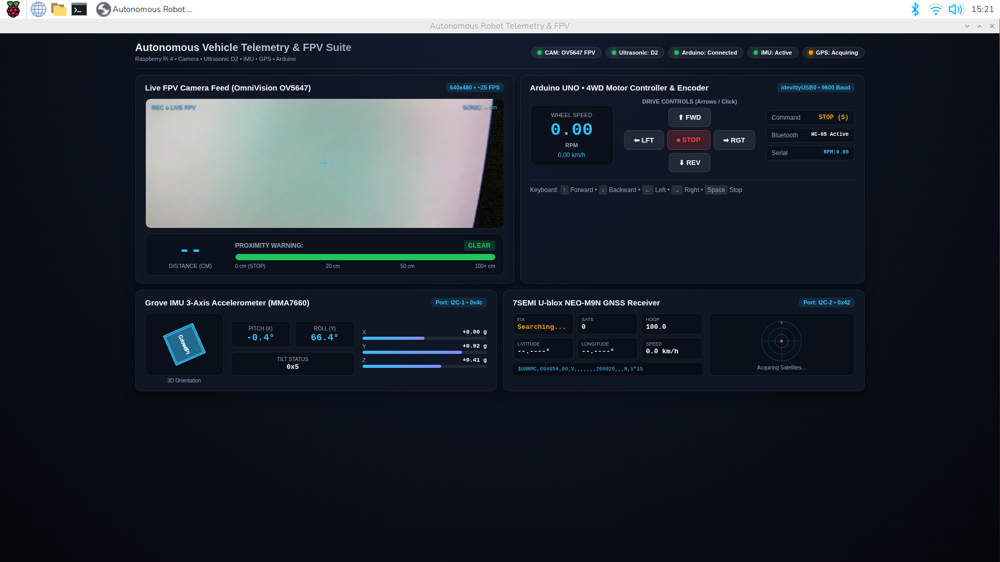
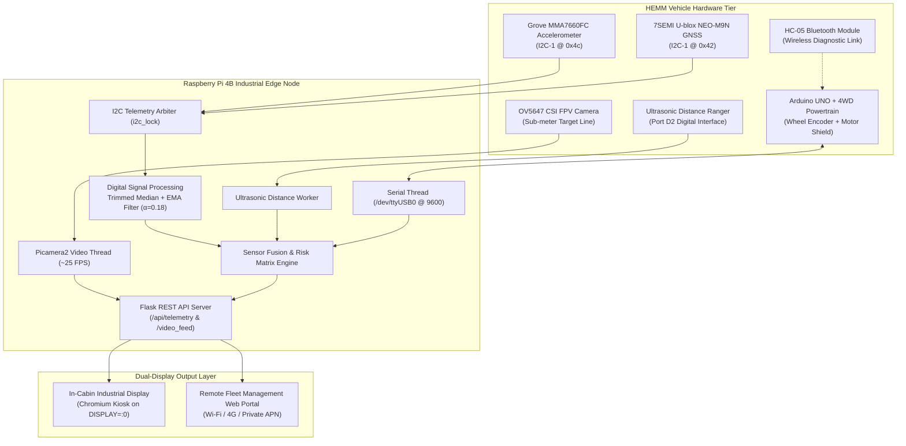

# Mine Vision-X
### AI-Based Fog-Safe HEMM Vehicle Safety & Fleet Monitoring System

[](LICENSE)
[](https://www.python.org/)
[](https://www.raspberrypi.org/)
[](https://www.arduino.cc/)
[](https://palletsprojects.com/p/flask/)
[](https://ultralytics.com)

---

## 📌 Project Overview
**Mine Vision-X** is an edge-intelligent vehicle safety, driver-assistance (ADAS), and fleet monitoring telemetry platform engineered specifically for **Heavy Earth Moving Machinery (HEMM)**—including haul trucks, hydraulic excavators, wheel loaders, and dumpers—operating in high-risk open-pit and subterranean mining environments.

Operating conditions in surface mines subject heavy machinery to extreme visibility impairment: dense winter fog, high-particulate coal/silica dust clouds, blinding rainfall, low-lux night shifts, and severe terrain slopes. **Mine Vision-X** fuses edge computer vision, real-time multi-spectral distance ranging, high-precision multi-constellation GNSS satellite positioning, 3-axis inertial motion telemetry, and real-time powertrain encoder analytics into a unified operator HUD and fleet telemetry gateway.



---

## ⚠️ Problem Statement
Heavy Earth Moving Machinery in open-cast mines operate within treacherous, dynamic environments. The key challenges addressed are:
1. **Zero-Visibility Collisions**: Dust clouds generated during dump cycles and seasonal fog cause catastrophic blind-spot collisions between haul trucks and light utility vehicles (LMVs).
2. **Rollover & Haul Road Haulage Hazards**: Steep gradients, unbanked haul curves, and berm degradation lead to vehicle tipping and edge roll-offs.
3. **Delayed Fleet Telemetry**: Lack of consolidated edge sensing creates communication blackouts for central dispatchers monitoring vehicle speeds, slip ratios, and mechanical stress.
4. **Driver Fatigue & Cognitive Overload**: Operating massive tonnage vehicles in poor weather conditions increases cognitive fatigue; drivers lack automated proximity warnings and slope angle indicators.

---

## 🎯 Objectives
* **Real-Time Obstacle Perception**: Deliver sub-100ms proximity and obstacle warnings in dense fog and dust conditions.
* **3D Attitude & Stability Telemetry**: Monitor vehicle pitch, roll, and dynamic tilt angles with multi-stage digital signal filtering to avert rollovers.
* **Centimeter-Accurate Fleet Tracking**: Acquire high-reliability GNSS positioning (NEO-M9N) with dilution-of-precision (HDOP) monitoring and satellite health radar.
* **Powertrain & Speed Monitoring**: Monitor wheel encoder RPM, calculate true linear velocity ($km/h$), and provide fail-safe motor drive commands.
* **Dual Edge Deployment**: Provide an ultra-low latency operator display on the in-cabin HDMI monitor alongside a wireless web dashboard for remote fleet supervisors.

---

## 🚀 Key Features

| Category | Feature | Technical Implementation |
| :--- | :--- | :--- |
| **Vision & FPV** | Real-Time Optical Feed | OV5647 CSI Camera (640x480 @ ~25 FPS) via Picamera2 pipeline with HUD crosshair overlays. |
| **Ranging & Safety** | Ultrasonic Proximity Meter | Multi-stage dynamic distance ranging with automatic triple-tier warning thresholds (Clear / Caution / Obstacle Close). |
| **Attitude & IMU** | 3D Rollover Protection | MMA7660FC 3-axis accelerometer filtered via Trimmed Median + Exponential Moving Average ($\alpha=0.18$) and CSS 3D cube model. |
| **GNSS & Radar** | High-Precision Fleet Geolocation | 7SEMI U-blox NEO-M9N GNSS module over I2C reading NMEA streams (`$GNGGA`, `$GNRMC`, `$GNGSA`) with circular radar HUD. |
| **Drive & Control** | Arduino 4WD Telematics | Bidirectional serial interface (`/dev/ttyUSB0`) decoding optical wheel encoder RPM, calculating linear velocity, and executing failsafe drive commands. |
| **Industrial Service** | Systemd Daemon Auto-Start | Self-healing `grovepi-telemetry.service` with automated start-up, watchdog polling, and clean thread termination. |

---

## 🏗️ System Architecture



---

## 🧰 Hardware Bill of Materials (BOM)

### Prototype Hardware
1. **Primary SBC**: Raspberry Pi 4 Model B (4GB RAM, Quad-Core Cortex-A72 @ 1.5 GHz).
2. **Interface Carrier**: Seeed Studio Grove Base Hat for Raspberry Pi.
3. **Optical Perception**: OmniVision OV5647 5MP Camera Module connected via 15-pin MIPI CSI interface.
4. **Proximity Ranging**: Grove Ultrasonic Ranger module (single-wire trigger/echo timing).
5. **Inertial Measurement**: Grove MMA7660FC 3-Axis Digital Accelerometer ($\pm 1.5g$, I2C address `0x4c`).
6. **Satellite Positioning**: 7SEMI U-blox NEO-M9N GNSS High-Precision Multi-Constellation Receiver (I2C address `0x42`) with active ceramic patch antenna.
7. **Powertrain Controller**: Arduino UNO R3 (ATmega328P) mated with L293D/L298P motor shield.
8. **Drive Chassis**: 4WD Robotic Platform with 4x Geared DC Motors and slotted optical wheel encoder disc.
9. **Wireless Link**: HC-05 Bluetooth 2.0+EDR module paired with Pi Bluetooth stack.
10. **Power Distribution**: Isolated dual-rail buck regulation (5V/3A for Pi, 7.4V LiPo for 4WD motors).

---

## 💻 Software Stack
* **Operating System**: Raspberry Pi OS (64-bit Debian GNU/Linux 13 Trixie, kernel 6.6+).
* **Backend Framework**: Python 3.11+ / Flask multi-threaded HTTP server.
* **Camera Capture**: `Picamera2` libcamera-native hardware pipeline (JPEG stream chunked over multipart MIME).
* **Serial Protocol**: `pyserial` handling full-duplex non-blocking buffered ASCII telemetry.
* **Bus Communication**: `smbus` / `smbus2` communicating over `/dev/i2c-1` with hardware mutex locks (`threading.Lock`).
* **Frontend**: HTML5, CSS3 3D Perspective Canvas, JavaScript ES6 asynchronous polling (`fetch API`), SVG Radar HUD.
* **Process Orchestration**: Linux `systemd` supervisor with watchdog restarts and multi-user target dependency.

---

## 🧠 AI / YOLO Perception Pipeline
In the industrial mining deployment, the optical feed feeds directly into an edge-accelerated YOLO detection architecture:

```
[Raw Camera Stream] 
        ↓
[Fog/Dust Dehazing Pre-Processing (DCP / Contrast Equalization)]
        ↓
[YOLOv8-Nano / TensorRT INT8 Engine @ 30+ FPS]
        ↓
[Class Detections: HEMM Haul Truck, LMV, Mining Personnel, Rock Berm, Boulder]
        ↓
[Bounding Box 2D Coordinates + Depth Fusion]
        ↓
[Driver Threat Alert & Active Collision Avoidance Override]
```

* **Target Classes**: Personnel with high-visibility PPE, haul trucks, excavation shovels, stationary utility vehicles, rocks/boulders, haul road crests.
* **Atmospheric Dehazing**: Integrated Dark Channel Prior (DCP) pre-filter and adaptive histogram equalization to penetrate dense coal dust and mist.

---

## 🔄 Sensor Fusion & Signal Processing

### 1. IMU Jitter Filtering (EMA + Median)
Raw $I^2C$ accelerometer data in heavy mining machinery suffers from high mechanical vibration. Mine Vision-X uses a multi-stage stabilization pipeline:
1. **Alert Bit Filtering**: Rejects frame reads where bit 6 indicates hardware read collision.
2. **Trimmed Median Filter**: Retains a rolling 5-sample buffer to eliminate impulse spikes.
3. **Exponential Moving Average (EMA)**:
   $$\bar{x}_t = \alpha \cdot x_t + (1 - \alpha) \cdot \bar{x}_{t-1}$$
   where $\alpha = 0.18$ provides smooth pitch and roll transitions while maintaining responsiveness.
4. **Deadband Thresholding**: Rejects angular micro-vibrations below $\pm 0.35^\circ$.

### 2. Multi-Constellation GNSS Parsing
The U-blox NEO-M9N engine processes concurrent signals from GPS, GLONASS, Galileo, and BeiDou. The worker streams raw NMEA registers over I2C, extracting:
* `$GNGGA`: UTC Timestamp, Latitude/Longitude coordinates, Fix Quality indicator, Active Satellite Count, Horizontal Dilution of Precision (HDOP), and Altitude.
* `$GNRMC`: Validity flags, Ground Speed ($knots \to km/h$), and Track Angle.

---

## 🚨 Risk Assessment & Alert States

The safety engine computes threat levels dynamically:

```mermaid
stateDiagram-v2
    [*] --> Green_State: Sensor Telemetry Normal
    
    Green_State --> Yellow_Caution: Distance < 45 cm OR Roll/Pitch > 15°
    Yellow_Caution --> Red_Critical: Distance < 18 cm OR Roll/Pitch > 30°
    Red_Critical --> Red_Critical: Active Collision Threat / Danger of Rollover
    
    Red_Critical --> Yellow_Caution: Distance >= 18 cm
    Yellow_Caution --> Green_State: Distance >= 45 cm AND Orientation Nominal

    state Green_State {
        direction LR
        Status: "CLEAR"
        HUD: "Green Border"
        Braking: "Manual Control Enabled"
    }
    state Yellow_Caution {
        direction LR
        Status: "CAUTION"
        HUD: "Pulsing Yellow HUD"
        Braking: "Speed Clamped to 50%"
    }
    state Red_Critical {
        direction LR
        Status: "OBSTACLE CLOSE!"
        HUD: "Flashing Red Alert"
        Braking: "Emergency Stop (CMD: S)"
    }
```

---

## 📂 Project Structure
```
Mine-Vision-X/
│
├── app.py                      # Main Flask application, background workers, and embedded dashboard
├── requirements.txt            # Python dependencies (Flask, pyserial, smbus2, numpy)
├── grovepi-telemetry.service   # Systemd service configuration for autonomous boot
├── index.html                  # Standalone telemetry web template
├── .gitignore                  # Git ignore specification
├── LICENSE                     # MIT License
├── README.md                   # Complete system documentation
│
├── docs/                       # Project documentation & media
│   └── images/
│       └── dashboard_preview.png # Live verified HUD dashboard screenshot
│
├── check_arduino.py            # Serial port baud-rate and buffer probe
├── monitor_arduino.py          # Real-time wheel encoder RPM terminal monitor
├── probe_sensors.py            # I2C bus scanner and register validation tool
├── probe_ultrasonic.py         # Port diagnostic utility for ultrasonic ranger
├── read_gps.py                 # Standalone U-blox NMEA stream decoder
├── send_motor_cmd.py           # Terminal utility for sending motor commands
├── test_commands.py            # Interactive Arduino command test harness
└── test_imu_stability.py       # IMU filter benchmarking and stability test
```

---

## ⚡ Installation Instructions

### 1. Hardware Prerequisite Configuration
Ensure I2C, SPI, and Camera interfaces are enabled on your Raspberry Pi:
```bash
sudo raspi-config
# Navigate to: Interface Options -> Enable I2C, SPI, and Camera
sudo reboot
```

### 2. Clone the Repository
```bash
git clone <YOUR_GITHUB_REPOSITORY_URL>
cd Mine-Vision-X
```

### 3. Install System & Python Dependencies
```bash
# Update APT and install essential I2C/build tools
sudo apt-get update
sudo apt-get install -y python3-pip python3-smbus i2c-tools python3-serial

# Install required Python packages
pip3 install -r requirements.txt --break-system-packages
```

---

## 🚦 Running Instructions

### Manual Execution
Run the Flask server directly from the terminal:
```bash
python3 app.py
```
* **Local In-Cabin Display**: Open Chromium in kiosk mode:
  ```bash
  chromium-browser --app=http://127.0.0.1:5000 --start-maximized
  ```
* **Remote Fleet Portal**: Open any web browser on the same Wi-Fi / cellular network:
  ```
  http://<RASPBERRY_PI_IP>:5000
  ```

### Automated Daemon Execution (Systemd)
To ensure the dashboard starts automatically upon vehicle ignition:
```bash
# Copy systemd service file
sudo cp grovepi-telemetry.service /etc/systemd/system/grovepi-telemetry.service

# Reload systemd, enable on boot, and start
sudo systemctl daemon-reload
sudo systemctl enable grovepi-telemetry.service
sudo systemctl start grovepi-telemetry.service

# Check service status
systemctl status grovepi-telemetry.service
```

---

## 🏭 Prototype vs. Industrial Architecture

```
PROTOTYPE ARCHITECTURE                INDUSTRIAL TARGET ARCHITECTURE
─────────────────────────────────     ─────────────────────────────────────────
Raspberry Pi 4B (4GB)             ──> Ruggedized Jetson AGX Orin Industrial
OV5647 CSI Camera (5MP)           ──> IP69K Heated LWIR Thermal + HDR GMSL2 Camera
Ultrasonic Sensor (40 kHz)        ──> 77 GHz Automotive mmWave Radar
Grove MMA7660FC (±1.5g)           ──> Honeywell / Bosch Rugged 6-DoF Industrial IMU
7SEMI U-blox NEO-M9N GNSS         ──> Dual-Antenna RTK-GNSS (Centimeter Precision)
Arduino UNO (Serial USB)          ──> Isolated CAN Bus (J1939 Mining Heavy Protocol)
Standard Wi-Fi / Hotspot          ──> Private Mine LTE / 5G Dedicated Slice
Acrylic 4WD Robot Chassis         ──> 240-Tonne CAT 793F / Komatsu 930E Haul Truck
```

---

## 🔮 Future Scope
* **Infrared / Thermal Camera Fusion**: Integrate Long-Wave Infrared (LWIR) cameras to detect warm equipment and human body heat in zero-light and dense smoke scenarios.
* **Stereo Depth Mapping**: Replace single-pin ultrasound with stereo depth camera pairs to generate point clouds of open-pit haulage roads.
* **Mine Fleet Cloud V2X**: Integrate MQTT / OPC-UA telemetry bridges into central mine dispatch suites (e.g., Modular Mining DISPATCH, Wenco).
* **Automated Emergency Braking (AEB)**: Direct integration into the machine's electro-hydraulic braking circuit for autonomous obstacle interlocks.

---

## 📄 License
This project is licensed under the MIT License - see the [LICENSE](LICENSE) file for details.
