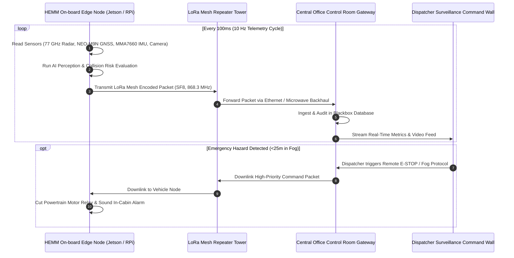

# Mine Vision-X | Central Fleet Control Room Architecture

### Central Office for Security Surveillance & Remote Dispatch (Away from Vehicle)

---

## 1. Executive Summary

In modern open-pit surface mining operations (e.g. Coal, Iron Ore, Bauxite), **Heavy Earth Moving Machinery (HEMM)**—including 100-ton haul dumpers, hydraulic excavators, wheel loaders, and track bulldozers—operate in hazardous environments characterized by dense fog, particulate coal dust, blinding rain, and steep haul road gradients.

**Mine Vision-X** separates operations into two distinct, communicating tiers:
1. **On-Vehicle Edge Perception Tier**: On-board industrial computing node (NVIDIA Jetson Orin Nano / Raspberry Pi 4) fusing 77 GHz mmWave radar, LWIR thermal vision, u-blox NEO-M9N GNSS, 6-axis IMU, and powertrain encoder into a driver-assistance HUD.
2. **Central Office Security Surveillance & Fleet Control Tier**: A command room situated safely on a hilltop away from the quarry pits, monitoring all machinery across sectors, calculating collision vectors, and exercising remote safety override (E-STOP, sirens, speed governors).

The bridge between the machinery in the quarry and the command center is the **Wireless Telemetry Transmutation Layer**, operating over **LoRa Mesh (868/915 MHz)** and **Private 4G / LTE APN**.

---

## 2. Telemetry Transmutation Pipeline

---

## 3. Sensing & Hardware Fused

### A. 77 GHz mmWave Automotive Radar
* **Band**: 76 - 81 GHz FMCW Radar.
* **Range**: Up to 150 meters with 0.1m resolution.
* **Immunity**: Penetrates dense coal dust, heavy rain, thick fog, and complete darkness.
* **Parameters Transmuted**: Target range ($m$), relative velocity ($km/h$), azimuth angle ($\theta$), Time-to-Collision ($TTC$).

### B. Thermal / Infrared (LWIR) Vision
* **Sensor**: Long-Wave Infrared (8–14 $\mu m$) thermal camera core.
* **Palette**: FLIR Ironbow / White-Hot false-color rendering.
* **Detection**: Identifies heat signatures of ground personnel ($37^\circ C$) and machinery exhausts/engines ($80–120^\circ C$) obscured by fog.

### C. u-blox NEO-M9N GNSS Satellite Positioning
* **Constellations**: Multi-constellation concurrent reception (GPS, GLONASS, Galileo, BeiDou).
* **Fix Accuracy**: Sub-meter accuracy with Dilution-of-Precision ($HDOP < 1.0$).
* **Parameters Transmuted**: Latitude, longitude, altitude ($m$), ground speed ($km/h$), satellite count.

### D. 6-Axis Inertial Motion Telemetry (MMA7660 / Jetson IMU)
* **Measurement**: 3-Axis Acceleration ($A_x, A_y, A_z$) and derived Pitch ($\theta$) and Roll ($\phi$).
* **Digital Signal Processing**: Trimmed Median Filter + Exponential Moving Average ($\alpha = 0.18$).
* **Rollover Index**: Triggers caution alert at haul road gradients $>12^\circ$ and critical warning at $>22^\circ$.

### E. Powertrain & Linear Speed Telematics
* **Interface**: Arduino UNO 4WD optical wheel encoder over bidirectional serial (`/dev/ttyUSB0` @ 9600 baud).
* **Speed Calculation**: $v = \text{RPM} \times 0.01224 \text{ km/h}$.

---

## 4. Network Transmutation Specs

| Metric | Specification |
| :--- | :--- |
| **LoRa Mesh Frequency** | 868.1 – 868.5 MHz (EU/IN Industrial ISM) / 915 MHz |
| **Modulation** | Chirp Spread Spectrum (CSS) with Spreading Factor SF8 |
| **Bandwidth** | 125 kHz / 250 kHz |
| **Typical Packet Latency** | 28 – 45 ms per hop |
| **Packet Delivery Ratio (PDR)** | $>99.5\%$ with automated multi-path mesh re-routing |
| **Secondary Cellular APN** | Industrial Private 4G LTE CAT-M1 / NB-IoT for MJPEG video uplinks |

---

## 5. Security Surveillance Functions in Central Office

1. **Panoramic Video Wall Command Mode**: Supports multi-screen projection displays matching industrial command rooms.
2. **Tactical GIS Vector Tracking**: Full spatial visibility of pit contours, benches, haul road ramps, crusher plants, and blast zones.
3. **Automated Collision Warning**: Active red vector line drawn when two vehicles enter each other's 35-meter proximity safety envelope.
4. **Dispatcher Remote Controls**:
   - `Remote E-STOP`: Direct propulsion freeze.
   - `Siren / Fog Horn`: Remote audio alert to scatter workers.
   - `Cabin HUD Broadcast`: Two-way text dispatch to in-cabin display.
   - `Global Fog Mode`: Imposes strict 15 km/h convoy speed limit across the entire pit.
5. **Blackbox Audit Trail**: Persistent timestamped event logs for regulatory compliance (DGMS / OSHA).
