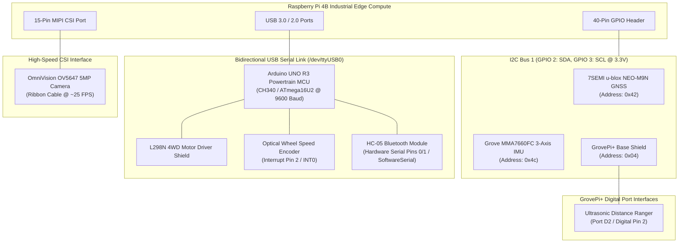

# Mine Vision-X | Hardware Wiring, Bus Topologies & Pinouts

Comprehensive pinout reference for the **Mine Vision-X** on-board perception and compute platform.

---

## 1. System Bus Topology

---

## 2. Pinout & Connection Mapping

### A. I2C Bus 1 (Raspberry Pi 40-Pin Header)
* **Pin 1**: `3.3V DC Power`
* **Pin 3**: `GPIO 2 (SDA)` — Connected to NEO-M9N SDA and MMA7660 SDA
* **Pin 5**: `GPIO 3 (SCL)` — Connected to NEO-M9N SCL and MMA7660 SCL
* **Pin 6 / 9**: `Ground (GND)`

| Device | Interface | Default Address | Operating Voltage | Function |
| :--- | :--- | :--- | :--- | :--- |
| **7SEMI u-blox NEO-M9N** | I2C-1 | `0x42` | 3.3V | Multi-constellation GNSS Satellite Navigation |
| **Grove MMA7660FC** | I2C-1 | `0x4c` | 3.3V | 3-Axis Accelerometer & Rollover Hazard Detection |
| **GrovePi+ Base Shield** | I2C-1 | `0x04` | 5.0V | Digital I/O Coprocessor (ATmega328P) |

---

### B. Ultrasonic Distance Sensor (GrovePi Port D2)
* **Port**: Digital Port `D2` on GrovePi Base Shield
* **Interface**: Single-wire bidirectional trigger/echo protocol
* **Operating Voltage**: 5.0V DC
* **Range**: $2\text{ cm}$ to $400\text{ cm}$ ($\pm 1\text{ cm}$ resolution)
* **Pinout**:
  - `Pin 1 (Yellow)`: Digital Signal (`D2`)
  - `Pin 2 (White)`: Unused / NC
  - `Pin 3 (Red)`: `VCC (+5V)`
  - `Pin 4 (Black)`: `GND`

---

### C. Arduino UNO 4WD Powertrain & Encoder
* **Interface**: USB Serial (`/dev/ttyUSB0` on Linux, `COMx` on Windows) @ 9600 baud
* **Motor Shield Configuration (L298N / Dual H-Bridge)**:
  - `Pin 4, 5`: Left Motor Direction & PWM Speed
  - `Pin 6, 7`: Right Motor Direction & PWM Speed
  - `Pin 2 (INT0)`: Optical Wheel Encoder Interrupt Input (pulses measured per revolution)
* **HC-05 Bluetooth Module (Wireless Diagnostic Link)**:
  - `TXD`: Connected to Arduino `RX` (Pin 0 via voltage divider: $5\text{V} \to 3.3\text{V}$)
  - `RXD`: Connected to Arduino `TX` (Pin 1)
  - `VCC`: 5.0V
  - `GND`: Ground

---

### D. CSI Camera Subsystem
* **Sensor**: OmniVision OV5647 5MP Fixed Focus Module
* **Interface**: 15-pin MIPI CSI-2 Ribbon Cable connected directly to Raspberry Pi CSI Port
* **Resolution / Framerate**: $640 \times 480$ @ 25 FPS (optimized for sub-100ms ADAS HUD latency)
