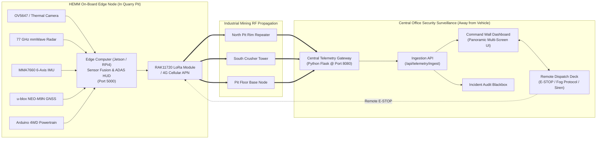

# Mine Vision-X | Central Fleet Control Room & Security Surveillance System

### Central Command Office for Heavy Earth Moving Machinery (HEMM) Safety Monitoring & Remote Dispatch

[](https://www.python.org/)
[]()
[]()

---

## 📌 Overview

The **Mine Vision-X Central Fleet Control Room** is an industrial security surveillance and centralized fleet monitoring command center engineered for open-pit, quarry, and underground mining operations.

Situated safely in a hilltop central office **away from the dangerous quarry pit and heavy vehicles**, the system continuously ingests, decodes, and displays all telemetry and security surveillance streams **transmuted in real-time from on-board vehicle computers (Raspberry Pi 4 / NVIDIA Jetson Orin Nano)** over a **Hybrid 4G / LoRa Mesh Network**.


*Central Office Multi-Screen Command Wall overseeing all HEMM vehicles across open-pit mine sectors.*

---

## 🎥 Video Reference & Alignment

Based on the project concept demonstrated in [Mine Vision-X (YouTube)](https://youtu.be/JxRxO8PUYvE):

| Timestamp / Frame | Concept Demonstrated in Video | Control Room Implementation |
| :--- | :--- | :--- |
| **00:15 - 00:24** (`frame_020s`) | **77 GHz mmWave Radar** for obstacle detection in zero-visibility fog/dust | Real-time 77 GHz polar radar scope with 120° sweep, relative speed, and range blips. |
| **00:24 - 00:28** (`frame_025s`) | **u-blox NEO-M9N GNSS Receiver** locating vehicles across mine pit | Tactical GIS vector map tracking vehicle lat/lon coordinates, speed, and heading. |
| **00:28 - 00:36** (`frame_035s`) | **Thermal / IR Fog Vision** revealing heat signatures of workers and haul trucks | Dual-mode surveillance viewport (Optical CSI + Thermal LWIR FLIR Ironbow). |
| **00:36 - 00:44** (`frame_040s`) | **6-Axis IMU (MMA7660 / Jetson IMU)** tracking pitch, roll, slope & rollover | Real-time 3D Three.js Haul Truck Attitude Gyro & haul road slope safety progress bar. |
| **00:58 - 01:08** (`frame_060s`) | **NVIDIA Jetson Orin** AI sensor fusion computation | Sensor fusion risk matrix evaluating collision probability & dynamic safety rings. |
| **01:08 - 01:20** (`frame_075s`, `080s`) | **LoRa Mesh + 4G Network** transmuting packets across open pit to base station | Wireless telemetry transmutation gateway tracking RSSI, SNR, PDR, latency, hops. |
| **01:20 - 01:34** (`frame_085s`) | **In-Cabin Driver Warnings** delivering timely alerts before collisions | Dispatcher tele-action broadcasting messages & warnings directly to driver cabin HUD. |
| **01:35 - 01:41** (`frame_095s`, `098s`) | **Central Control Room** receiving all links for operational safety | Full-featured Central Command Center Wall with multi-camera grid and remote E-STOP. |

---

## 🏗️ System Architecture: Vehicle to Control Room Transmutation



---

## 🚀 Quick Start Instructions

### 1. Launch the Central Fleet Control Room
Double-click `launch_fleet_control.bat` (or use the desktop shortcut `Launch_Fleet_Control_Room.bat`).

This command:
1. Starts the Central Command Gateway server on `http://localhost:8080`.
2. Automatically opens your default web browser to the Command Room Dashboard.
3. Automatically begins listening for physical vehicle telemetry and simulates multi-vehicle mining operations.

### 2. Connect a Physical Vehicle (Optional)
If running on the actual vehicle hardware (Raspberry Pi 4 or NVIDIA Jetson running the vehicle edge suite on port 5000):
- **Method A (Automatic Polling)**: The control room automatically attempts to bridge with `http://127.0.0.1:5000`.
- **Method B (Custom Network IP)**: Click the **`VEHICLE LINK`** button in the top navigation bar and enter your vehicle's Wi-Fi / APN IP address (e.g. `http://192.168.1.100:5000`).
- **Method C (Dedicated Client)**: Run `launch_transmuter_client.bat` or:
  ```bash
  python vehicle_transmuter_client.py --id HEMM-101 --local http://127.0.0.1:5000/api/telemetry --central http://<control_room_ip>:8080/api/telemetry/ingest
  ```

---

## 🎛️ Key Capabilities

1. **Multi-Vehicle Fleet Surveillance**:
   - **HEMM-101**: CAT 777G Off-Highway Haul Truck (Active Mine Vision-X prototype).
   - **HEMM-102**: Komatsu HD785 Haul Truck unloading at Primary Gyratory Crusher.
   - **HEMM-204**: CAT 6020B Hydraulic Shovel Excavator digging Bench #4.
   - **HEMM-305**: Komatsu WA600 Wheel Loader clearing Stockpile Alpha.
   - **HEMM-408**: CAT D11T Track Bulldozer grading Haul Road Curve B.
   - **LMV-012**: Toyota Hilux 4x4 Mine Security Patrol.

2. **Optical & Thermal Dual-Mode Surveillance Feed**:
   - High-contrast optical feed with real-time AI bounding boxes for humans and mining machinery.
   - LWIR Thermal Infrared (FLIR Ironbow) highlighting worker heat signatures and dumper engine temperatures through thick dust and dense winter fog.
   - Quad Wall Mode displaying 4 active camera channels simultaneously.

3. **Open-Pit Mine Tactical GIS & GNSS Tracking**:
   - Vector contour map of the Dhanbad open-cast mine pit.
   - Live satellite positioning via u-blox NEO-M9N (lat, lon, altitude, satellites, HDOP).
   - Dynamic collision proximity warning chords connecting vehicles within 35 meters.

4. **3D Attitude Gyro & Rollover Prevention**:
   - Real-time Three.js 3D Haul Truck model reflecting MMA7660 IMU pitch and roll.
   - Slope danger threshold monitoring with visual progress bar against the 12.0° safe limit.

5. **Remote Dispatch & Safety Tele-Controls**:
   - `🛑 REMOTE E-STOP`: Cuts motor power in critical emergency.
   - `📢 BLAST SIREN`: Remotely sounds the vehicle external acoustic fog horn.
   - `💬 TRANSMIT TO CABIN`: Broadcasts instructions to the operator's in-cabin HUD.
   - `🌫️ FOG PROTOCOL`: Enforces mine-wide 15 km/h convoy speed limit and 50m spacing.

---

## 📂 Folder Structure

```
C:\Users\User\Desktop\Mine_Vision_Fleet_Control_Room\
├── server.py                        # Central Control Room Gateway & Ingestion Backend
├── vehicle_transmuter_client.py     # On-vehicle edge client to push data to Central Room
├── requirements.txt                 # Dependencies
├── launch_fleet_control.bat         # 1-Click Launcher
├── launch_transmuter_client.bat     # Client Launcher
├── docs/
│   ├── SYSTEM_ARCHITECTURE.md       # Detailed technical architecture
│   └── reference_video_assets/      # 16 High-Res Keyframes extracted from YouTube video
├── templates/
│   └── index.html                   # Command Room Multi-Screen HTML5 Dashboard
└── static/
    ├── css/
    │   └── control_room.css         # Dark cyberpunk industrial command center theme
    ├── js/
    │   ├── app.js                   # State synchronization & tele-controls
    │   ├── map_engine.js            # SVG Open-Pit Mine GIS & Collision Avoidance
    │   ├── radar_visualizer.js      # 77 GHz mmWave Polar Radar Scope
    │   ├── attitude_gyro.js         # Three.js 3D Attitude Gyroscope
    │   ├── sound_effects.js         # Web Audio API siren & caution synthesizers
    │   └── three.min.js             # Three.js 3D library (offline)
    └── images/                      # Extracted frame snapshots & textures
```
